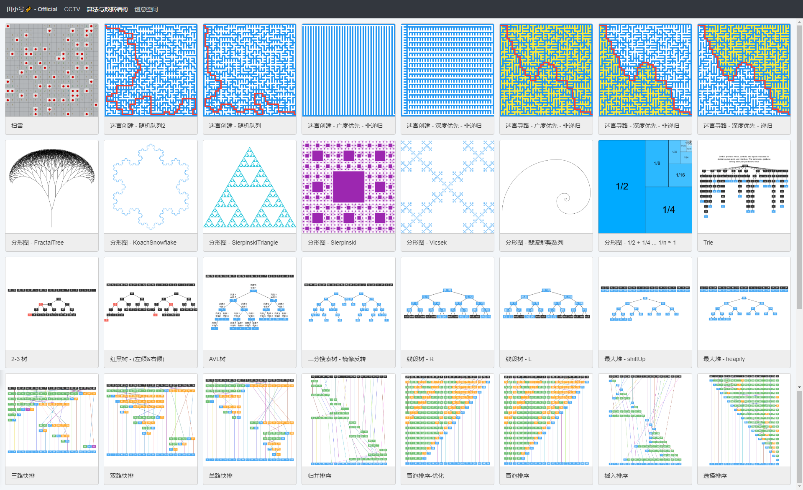

**感谢：**  
[liuyubobobo@imoon](https://www.imooc.com/t/108955)  
[liuyubobobo@github](https://github.com/liuyubobobo)  

**项目演示：**
[点击查看](http://codding.cn/#%7B%22coms%22%3A%5B%22algo%22%2C%22cctv%22%5D%2C%22page%22%3A%7B%22cur%22%3A0%2C%22size%22%3A100%2C%22total%22%3A149%7D%2C%22countAni%22%3A1%7D)

**课程参考：**  
[《看的见的算法 7个经典应用诠释算法精髓》](https://coding.imooc.com/learn/list/138.html)  
[《算法大神带你玩转数据结构 从入门到精通》](https://coding.imooc.com/learn/list/207.html)  
[《玩转算法与数据结构》](https://coding.imooc.com/learn/list/71.html)  

